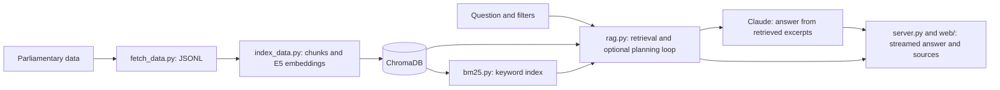

# Kammaren | Search Swedish parliamentary speeches

A local RAG application for exploring what members of Sweden's parliament have
said in debates. Ask a question in Swedish, filter by party, speaker or year, and
inspect the source excerpts behind a streamed answer.

The project explores a practical retrieval question: when does one search suffice,
and when does a question need several searches across speakers or parties?

**Stack:** Python · ChromaDB · multilingual E5 · BM25 · Anthropic API

**Status:** Local application under development.

## Project at a glance

| Question | What this project explores |
| --- | --- |
| Who is it for? | Readers exploring statements in Swedish parliamentary debates |
| How are sources found? | Vector and keyword retrieval, with party, speaker and year filters |
| What makes deep search different? | A bounded planning loop can request additional evidence |
| What has been evaluated? | Two earlier vector-search modes on 30 questions; see [results and limitations](#evaluation-and-its-limits) |
| What can be inspected? | Source excerpts, original links, test cases and evaluation code |

See [Architecture](#architecture), [Run locally](#run-locally) and
[Reliability checks](#reliability-checks) for implementation and setup details.

## Functionality

- **Quick search:** retrieve excerpts and generate a source-based answer.
- **Deep search:** an LLM plans subqueries, reviews the retrieved evidence, and
  requests additional searches within a configured round limit.
- **Hybrid retrieval:** combine multilingual E5 vector search with BM25 keyword
  search using reciprocal rank fusion (RRF).
- **Filters:** party, speaker and year range. Explicit user filters take precedence
  over filters proposed by the planner.
- **Evidence inspection:** expandable excerpts, links to the original parliamentary
  material, and Markdown export of the answer and source list.
- **Source diversity:** limit excerpts per speech, including across deep-search
  subqueries, so one speech cannot occupy every result slot.

Answers describe what speakers said; they do not establish that those statements
are true or represent a party's complete policy. Missing evidence is passed to
the answer model as an explicit limitation.

## Architecture



`rag.py` is shared by the standalone website, the older Streamlit interface
(`app.py`), the CLI (`ask.py`) and the evaluation script (`eval.py`). Embeddings
run locally; answer generation, planning and model-based evaluation use the
Anthropic API. Questions and selected excerpts are sent to that API.

## Run locally

The development environment uses Python 3.12. Indexing and live retrieval
currently require an NVIDIA GPU with a working CUDA-enabled PyTorch installation.
The embedding model is `intfloat/multilingual-e5-large`.

```bash
python3 -m venv .venv
.venv/bin/python -m pip install -r requirements.txt
```

Copy `.env.example` to `.env` and set `ANTHROPIC_API_KEY`. This file is
ignored by Git; the key stays on the server. API calls incur charges.

If you already have `chroma_db/` and `data/`, start the website:

```bash
.venv/bin/python server.py
```

Open **http://127.0.0.1:8000**. Initial loading may take a while. The server also
listens on the local network; it is intended for local use.

The older Streamlit interface can be started with
`.venv/bin/python -m streamlit run app.py`.

For a fresh dataset, run these steps in order before starting the website:

```bash
.venv/bin/python fetch_data.py
.venv/bin/python index_data.py
.venv/bin/python bm25.py
```

Fetching and indexing the full archive can take substantial time. For a small
first run, use `fetch_data.py --limit 500` in a fresh checkout. The scripts
resume previously completed work. BM25 is optional: without its index, the app
uses vector retrieval. Generated datasets, model weights and indexes are not
included in this repository.

## Reliability checks

```bash
.venv/bin/python -m unittest discover -s tests -v
```

The suite runs without an API key, model download, GPU or the full dataset, once
the Python dependencies are installed. It checks:

- Chunk size limits, overlap preservation and complete-speech indexing batches.
- Unknown speakers: a planned speaker with no match cannot silently become an
  unrestricted search; an unknown explicit speaker is rejected.
- User filter precedence, duplicate removal, overall excerpt limits, and bounded
  search rounds.
- Hybrid retrieval against a real, isolated in-memory Chroma collection and a
  real BM25 index, including unmatched filters and stale keyword-index IDs.
- Server search orchestration, validation, empty results and streaming event order.

Integration tests use fixed embeddings, and agent tests script the model's
decisions. These tests verify retrieval plumbing and control flow, **not semantic
search quality, live API compatibility or answer accuracy**.

## Evaluation and its limits

[The saved evaluation](eval_resultat.md) compares quick/vector and deep/vector
search on 30 questions in four categories. Its recorded averages are 20 seconds
per quick answer and 47 seconds per deep answer; citation-reference precision is
96% and 97%, respectively. These are historical measurements, not a benchmark of
the latest reliability changes or hybrid retrieval.

Citation-reference precision checks whether an emitted speaker/date reference
matches retrieved metadata. It does not prove that the associated claim is
supported. Groundedness is judged by a model from the same family as the answer
model and needs human validation. Several questions labelled “unanswerable”
actually have supporting material in the archive; that category needs revision.

`eval.py` uses paid API calls and resumes entries from `eval_resultat.json`.
Running it again does not automatically remeasure saved questions. Preserve the
historical results separately before creating a new benchmark.

## Usage examples

- Ask “Vad har sagts om slutförvar av använt kärnbränsle?” to search a specific topic.
- Use deep search for a broader question such as “Vad tycker partierna om kärnkraft?”
- Narrow the results by party, speaker or year, then expand the source excerpts
  and follow their original links.
- Export the answer and source list as Markdown.

## Current limitations

- The application accepts one active search at a time; search cancellation is
  not implemented.
- Dataset updates require keeping the vector index, BM25 index and cached
  `data/talare.json` in sync. Automatic refresh is not implemented.
- Dependency versions have lower bounds rather than a reproducible lock file.
- The chunking fix applies to newly indexed material; existing chunks are not
  automatically rebuilt.

Hybrid retrieval has not yet been benchmarked. The historical evaluation and
its measurement limits are described above.
